# Silver Platter

## Overview
The goal of the Silver Platter lab is to practice web application enumeration, researching and using a CVE to bypass authentication, and privilege escalation.

------

## Enumeration
I performed port scanning using nmap to identify services. 

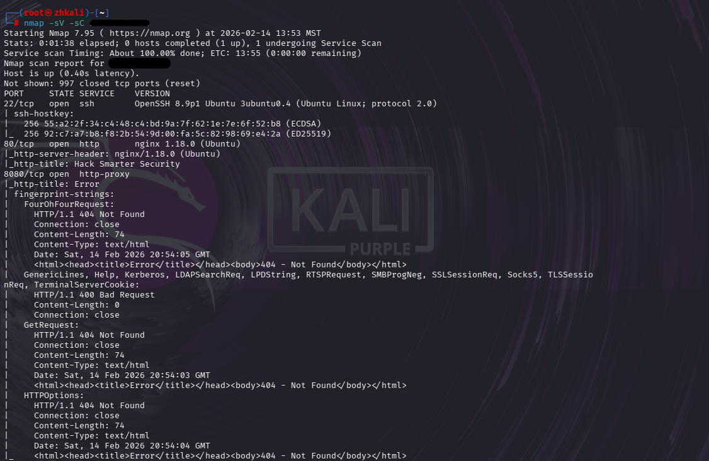

Open ports discovered:

- 22 – SSH
- 80 – HTTP
- 8080 – HTTP (proxy or application)

Port 8080 appeared to host a separate web application and became the main target.

------

## Web App

Accessing the main page on http://<TARGET_IP> showed a standard website. However, one page exposed a potential username. The name “Silverpeas” was also mentioned, which suggested the presence of a known application.

I then fuzzed http://<TARGET_IP>:8080/.

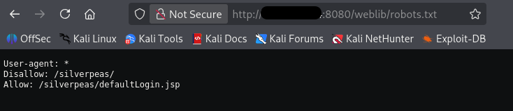

This application accepts credentials using:

- Content-Type: application/x-www-form-urlencoded
- username=?&password=?

Although brute-forcing was possible, the lab provided a hint that the organization enforces a strict password policy. This indicated that weak passwords were not the vulnerability and that the issue likely existed in the application logic.

------

## Authentication Bypass

While analyzing requests and responses in Burp Suite, several additional parameters were observed:

- DomainId
- ErrorCode
- JSESSIONID

That might be useful in future steps.

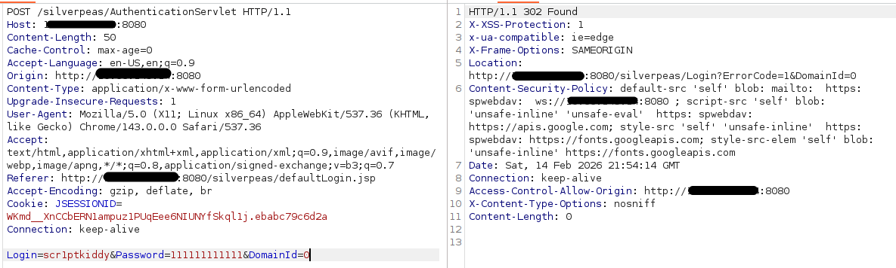

These parameters appeared during failed authentication attempts and suggested that the application relies on internal domain logic.

Multiple attempts were made to manipulate DomainId and ErrorCode, but they did not result in authentication bypass or information disclosure. At this point, brute-forcing and parameter fuzzing were abandoned, and focus shifted to known vulnerabilities affecting Silverpeas.

I found CVE-2024-36042, which describes an authentication bypass caused by improper handling of missing parameters. According to this CVE, removing the password field from the POST request can result in successful authentication without valid credentials.

This technique was tested using Burp Suite, and authentication was successfully bypassed.

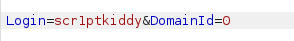

Now we have access to “scr1ptkiddy” account:

Once authenticated we can discover multiple accounts in “scr1ptkiddy” contacts list.

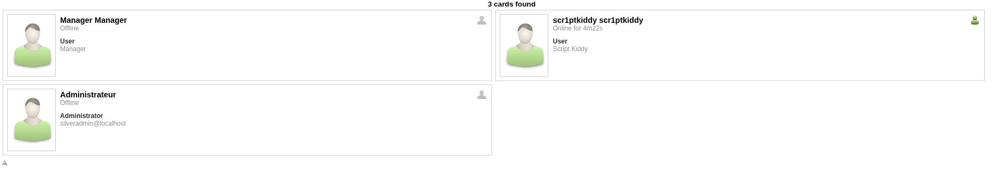

One noticeable element was “1 Unread Notification”.

When inspecting the request used to read messages, it was observed that message access relies on an ID parameter:

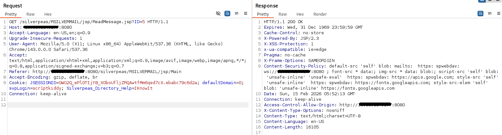

Note that ID in request has been changed to 5:

 “GET /silverpeas/RSILVERMAIL/jsp/ReadMessage.jsp?ID=5 HTTP/1.1”

Manually modifying ID value allowed access to other users messages, indicating IDOR vulnerability.

There is a message from user “Aministrateur” that contains SSH credentials for user “tim”.

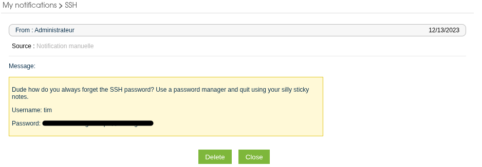

------

## SSH Access

Using the discovered credentials, an SSH connection was established as user tim. After logging in, the first flag was located in the user “tim” home directory.

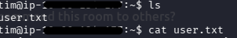

Several other user directories were also present under /home directory.

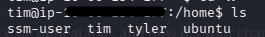

After obtaining the user flag, the next objective was to locate the administrator flag.

Since the initial access was done through authentication bypass (CVE-2024-36042), I used the same technique to access other users accounts.

Bypassing login directly for admin username failed and resulted in technical error. Attempting to bypass authentication as Manager was successful. However, the account did not provide any useful information.

At this stage, web escalation attempts were exhausted. Since no further info was obtained through the application (admin access error, manager low impact, no additional messages that contains useful data). I changed my focus to SSH connection and user tim permissions. 

tim@ip:/home$ id
uid=1001(tim) gid=1001(tim) groups=1001(tim),4(adm)

Checking group memberships revealed that user tim belonged to the adm group. Membership in adm allows read access to system log files.

Running LinPEAS revealed several readable logs containing sensitive information.

Reviewing other users in the /home directory identified a new target.

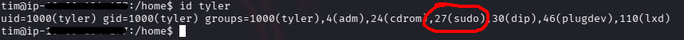

User “tyler” is a member of the sudo group.

As it was mentioned earlier, tim belongs to adm group which allows to read system log files. Given that “tyler” has sudo privileges, I decided to gather log files and grep lines that contains his username. 

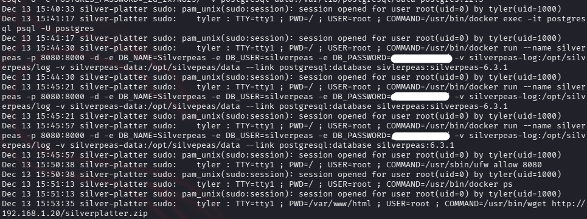

Among these log entries we can notice credentials (sensitive information) for user “tyler”.
This info was sufficient to authenticate as the “tyler” user via SSH.

